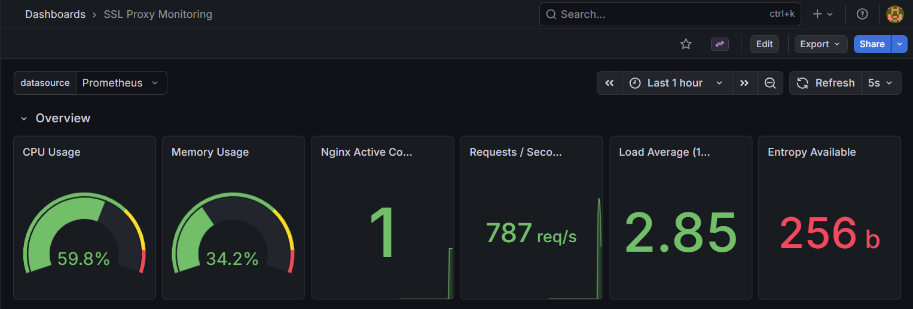
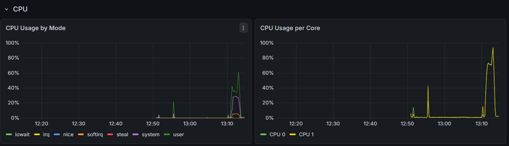
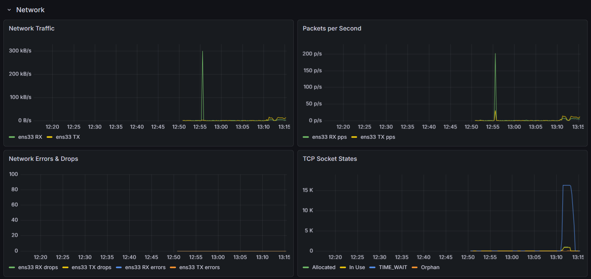
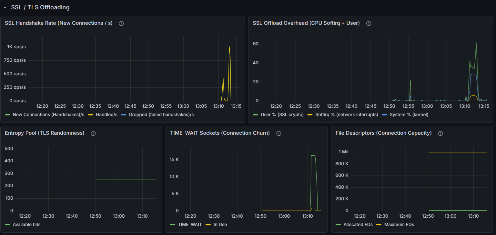
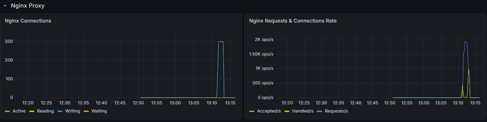

# Monitoring an SSL Offloading Proxy

## Understanding the server

Here's how I read the specs and why each one matters:

**4x Xeon E7-4830 v4 (56 cores, 112 threads)** — lots of CPU, and it needs to be.
SSL/TLS handshakes are CPU-heavy. At 25k req/s, the CPU is doing serious work.

**64GB RAM** — more than enough for a proxy.

**2TB HDD** — the weak link. At 25k req/s, just writing access logs can saturate the disk.

**2x 10Gbit NICs** — plenty of bandwidth.

---

## 1. Which metrics are interesting to monitor?

Given that this is an **SSL offloading proxy at 25k req/s**, I'd focus on these:

**CPU** — the #1 concern for SSL offloading:
- Per-core utilization 
- Breakdown by mode: user, network interrupts, disk
- Load average (should stay below core count)

**Network** — high traffic with two 10Gbit NICs:
- Bandwidth per NIC (bytes in/out)
- Packets per second (can hit limits before bandwidth)
- Packet drops and errors (silent data loss)
- TCP TIME_WAIT count (piles up fast at 25k req/s, can exhaust ephemeral ports)
- TCP retransmissions (sign of congestion or buffer issues)

**SSL/TLS** — the core function of this server:
- TLS handshake rate (new vs resumed — huge CPU difference)
- Session reuse ratio
- Certificate expiry
- Handshake errors

**Disk I/O** — because HDD is the bottleneck:
- Disk utilization % (expect it to be high just from logging)
- I/O wait time
- Free disk space

**System limits** — things that break silently at scale:
- Open file descriptors (each proxied request = 2 FDs)
- Kernel entropy pool (TLS needs randomness, can stall if depleted)

I didn't bother with detailed memory breakdowns — 64GB on a proxy won't be a problem unless there's a leak.

---

## 2. How would I monitor them?

**Prometheus + Grafana.** It's the industry standard for this, and it's what I used to build the demo.

```
  Client → [HTTPS] → Nginx (terminates TLS) → [HTTP] → Backend

  Monitoring:
  ├── node_exporter (:9100)        → CPU, memory, disk, network, TCP, entropy, FDs
  ├── nginx-prometheus-exporter (:9113) → connections, requests/s, connection states
  └── Prometheus (:9090)           → scrapes exporters, stores metrics, evaluates alerts
      └── Grafana (:3000)          → dashboards, visualization
```

**Why this stack:**
- `node_exporter` gives us all the system metrics from `/proc` and `/sys` with almost no overhead
- `nginx-prometheus-exporter` reads Nginx's `stub_status` for proxy-level metrics
- Prometheus scrapes every 15s — frequent enough without adding load
- Grafana ties it all together visually

**Alerts I'd set up:**

| What | Threshold | Why it matters |
|------|-----------|---------------|
| CPU > 95% | Critical | SSL processing is maxed out |
| Softirq CPU > 20% | Warning | Network interrupts overloading cores |
| Any swap usage | Critical | Proxy + swap = latency disaster |
| Packet drops | Critical | Losing traffic silently |
| TIME_WAIT > 50k | Warning | Ephemeral port exhaustion risk |
| Disk utilization > 90% | Warning | HDD can't keep up with logging |
| Entropy < 200 bits | Warning | TLS handshakes could stall |
| Nginx down | Critical | — |

**Kernel tuning** — defaults aren't enough for 25k req/s. Key changes:
- `somaxconn = 65535` (listen backlog)
- `tcp_tw_reuse = 1` (reuse TIME_WAIT sockets)
- `ip_local_port_range = 1024-65535` (more ephemeral ports)
- `file-max = 1000000` (enough FDs for all connections)

Full config in [`sysctl/99-ssl-proxy-tuning.conf`](./sysctl/99-ssl-proxy-tuning.conf).

### Demo

I built a working version of all of this — see [README.md](./README.md) for how to run it. Here's what the Grafana dashboard looks like under load:

#### Overview


#### CPU during SSL load


#### Network and TCP states


#### SSL/TLS offloading metrics


#### Nginx proxy metrics


---

## 3. What are the challenges?

- **HDD is the weak link** logging 25k req/s to a spinning disk (100-200 IOPS) will saturate it. Buffered logging or shipping logs off-server is needed.

- **Monitoring costs resources too** exporters and scrapes use CPU/disk on an already busy server. Keep scrape intervals reasonable (15s) and don't collect everything.

- **Network interrupts can pile on one core** with 2x 10Gbit NICs, if IRQ affinity isn't configured, one core gets all the interrupts while the others sit idle. Only visible per-core.

- **TIME_WAIT socket buildup** at 25k req/s, closed connections stick around in TIME_WAIT for ~60s. Can exhaust ephemeral ports. `tcp_tw_reuse` helps but doesn't eliminate it.

- **SSL session cache is hard to observe** Nginx doesn't expose cache hit/miss as metrics. The only indirect data comes from log variables like `$ssl_protocol`.

- **Entropy can run low** TLS needs randomness, heavy handshake load can drain the pool. `haveged` or hardware `RDRAND` fixes it, but it should still be monitored.

- **Averages lie at scale** "2ms average" might hide a p99 of 500ms. Need percentile metrics.

- **Correlating metrics is hard** a CPU spike could be TLS handshakes, a DDoS, or a slow backend. Lining up metrics from different sources takes practice.
